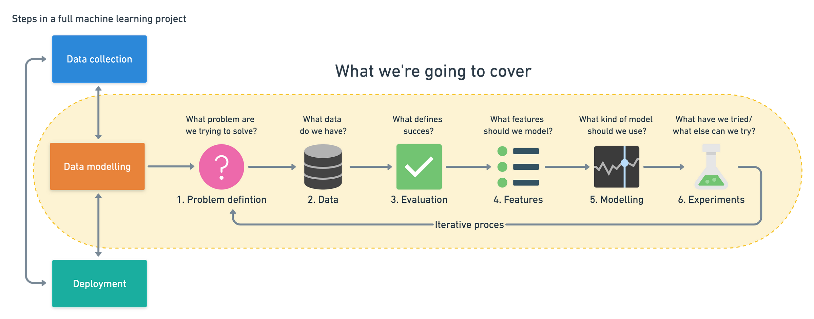

# A 6 Step Field Guide for Building Machine Learning Projects

Have data and want to know how you can use machine learning with it? [Read this](https://www.mrdbourke.com/a-6-step-field-guide-for-building-machine-learning-projects/).

## Steps in a full machine learning project

Machine learning projects can be broken into three steps, data collection, data modelling and deployment. This article focuses on steps within the data modelling phase and assumes you already have data. [Full version on Whimsical](https://whimsical.com/9g65jgoRYTxMXxDosndYTB?ref=mrdbourke.com).

## Overfitting and Underfitting Definitions

Before we get into the experimentation side of things, it's worth having a little reminder of overfitting and underfitting are.

All experiments should be conducted on different portions of your data.

- **Training data set** — Use this set for model training, 70–80% of your data is the standard.

- **Validation/development data set** — Use this set for model hyperparameter tuning and experimentation evaluation, 10–15% of your data is the standard.

- **Test data set** — Use this set for model testing and comparison, 10–15% of your data is the standard.

These amounts can fluctuate slightly, depending on your problem and the data you have.

Poor performance on training data means the model hasn’t learned properly and is **underfitting**. Try a different model, improve the existing one through hyperparameter or collect more data.

Great performance on the training data but poor performance on test data means your model doesn’t generalize well. Your model may be **overfitting** the training data. Try using a simpler model or making sure your the test data is of the same style your model is training on.

Another form of **overfitting** can come in the form of better performance on test data than training data. This may mean your testing data is leaking into your training data (incorrect data splits) or you've spent too much time optimizing your model for the test set data. Ensure your training and test datasets are kept separate at all times and avoid optimizing a models performance on the test set (use the training and validation sets for model improvement).

Poor performance once deployed (in the real world) means there’s a difference in what you trained and tested your model on and what is actually happening. Ensure the data you're using during experimentation matches up with the data you're using in production.

## Optional: Elements of AI

Massive effort getting through the first section! There was a lot to go through and if you're thinking, "wow this is too much...", don't worry, you're not alone. Machine learning is broad and learning a new skill takes time.

One place you might want to check out for some auxiliary learning whilst you go through the rest of this course is the [Elements of AI](https://www.elementsofai.com/) website.

It's got some great introductory explanations of many of the concepts involved in machine learning, data science and artificial intelligence.

Of course, going through the [Elements of AI](https://www.elementsofai.com/) material is completely optional. But if you need a break from coding (we'll be doing plenty of it), remember it's always there.

Now you've had an introduction to machine learning, let's get your computer set up for it!