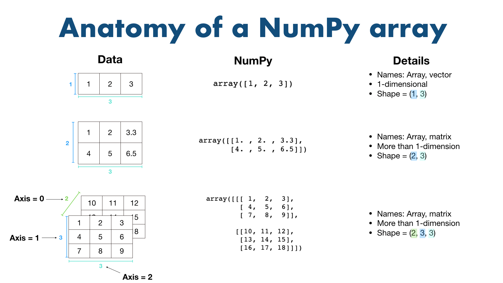

# Section : NumPy

Documentation for the latest version of NumPy can be found [here](https://numpy.org/doc/stable/index.html)

Why NumPy?
- It's fast
- Behind the scenes optimisations written in C
- Vectorisation via broadcasting (avoiding loops)
- Backbone of other Python scientific packages like Pandas

## Quick Note: Correction In Next Video
Hey everyone!

Just a quick note for the next couple of lectures which mention/show the "Anatomy of a NumPy Array" slide.

The code and concepts in the lectures are all correct, however, the slide displays the wrong array for the 3-dimensional array (you'll see these in the upcoming videos).

The correct slide should be:




The main difference is the bottom left array. In the videos it's displayed incorrectly.

If you'd like to get the same array as the "Anatomy of a NumPy Array" slide shows in the following videos, run the following code:

```python
a3 = np.array([[[1, 2, 3],
                [4, 5, 6]],
               [[7, 8, 9],
                [10, 11, 12]],
               [[13, 14, 15],
                [16, 17, 18]]])
```
And just another reminder, figuring out the different shapes of arrays can be a bit of a challenge! It takes a fair bit of practice to get used to them.